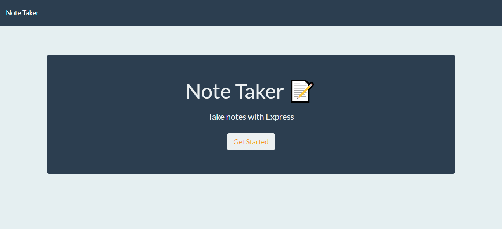
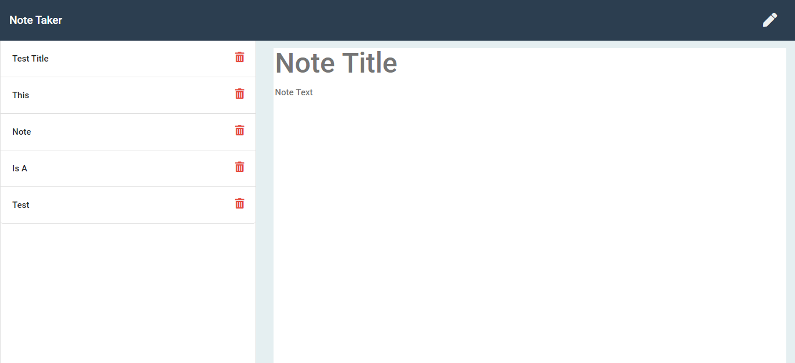

# Note Taker

## Live Link

## Contributors
DCampos07
    
## Table of Contents
<li><a href="#description">Description</a></li>  
<li><a href="#installation">Installation</a></li> 
<li><a href="#tech">Technology Stack</a></li> 
<li><a href="#usage">Usage</a></li> 
<li><a href="#screenshots">Screenshots</a></li> 
<li><a href="#contact">Contact</a></li> 
<li><a href="#tests">Tests</a></li> 
  
<h2 id= "description">Description</h2>
This is a project built on Node using Express. It is a simple app to take notes and save them, and when you're done you can delete.
  
<h2 id= "installation">Installation</h2>
npm i, run 'npm start'
    
<h2 id= "technology">Technology Stack</h2>
 Node.Js, Express, JavaScript, GIT, GitHub, HTML, CSS, Bootstrap
  
<h2 id= "usage">Usage</h2>
Use this to take and save notes on your computer.
  
<h2 id= "screenshots">Screenshots</h2>

<h2 id= "contact">Contact</h2>
<li>Name: Damaris Campos</li> 
<li>Github: https://github.com/DCampos07</li> 
<li>Portfolio: DCampos07.github.io</li>
<li>Email: <a href="mailto:dccampos00@gmail.com" target="_blank">dccampos00@gmail.com</a></li> 
<li>LinkedIn: </li> 
    
<h2 id= "tests">Tests</h2>

